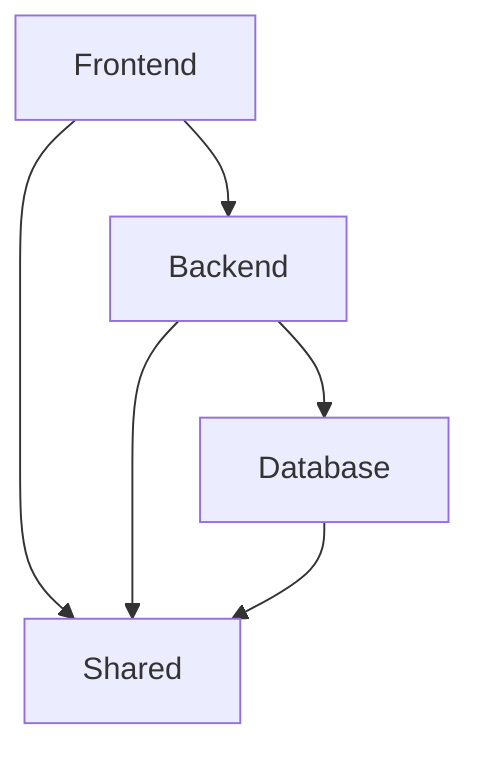

# Arquitectura del Proyecto

Este documento describe la estructura organizativa y arquitectónica del proyecto, el cual ha sido rediseñado para promover la **separación de responsabilidades**, escalabilidad y mantenibilidad.

## Filosofía de Diseño

El proyecto sigue una arquitectura modular en la que cada capa tiene responsabilidades estrictamente definidas. Esto previene el acoplamiento fuerte y permite a diferentes desarrolladores o equipos trabajar en áreas específicas sin afectar el sistema completo.

## Capas Aisladas

### 1. Frontend (`src/frontend`)
Contiene toda la lógica de presentación, interfaz de usuario y estado del cliente (React, Vite, Zustand, Tailwind).
- **components/**: Componentes de UI reutilizables.
- **views/**: Vistas o páginas completas de la aplicación.
- **hooks/**: Custom hooks de React para compartir lógica.
- **store/**: Manejo del estado global de la aplicación (Zustand u otros).
- **Archivos Raíz**: `App.tsx`, `main.tsx`, `index.css`.

El **Frontend** sólo debe comunicarse con el **Backend** a través de API o tRPC, no debe importar lógica de configuración de bases de datos directamente.

### 2. Backend (`src/backend`)
Contiene la lógica de negocio, endpoints y configuración del servidor (Express, tRPC, Firebase Admin/Servicios).
- **server/**: Lógica de los endpoints, routers de tRPC y el servidor principal.
- **services/**: Integración con servicios externos (Firebase, Gemini AI, etc.).

El **Backend** actúa como puente entre el **Frontend** y la **Base de Datos**. Las reglas de negocio y seguridad se aplican en esta capa.

### 3. Base de Datos (`src/database`)
Aísla la conexión, los esquemas (Drizzle ORM) y los datos en duro (mocks o bancos de preguntas).
- **db/**: Configuración de la conexión a la base de datos y esquemas de tablas.
- **data/**: Archivos estáticos de datos, bancos de exámenes y configuraciones de prueba.

### 4. Shared (`src/shared`)
Contiene todos los recursos compartidos entre el Frontend y el Backend. Esta es la *única* capa que se puede importar libremente desde ambas partes.
- **types/**: Tipos e interfaces de TypeScript.
- **constants/**: Variables y constantes globales del proyecto.
- **utils/**: Funciones puras utilitarias y helpers compartidos.
- **core/**: Lógica central o clases base que puedan ser usadas transversalmente.

## Diagrama de Flujo

> [!NOTE]
> Las importaciones cruzadas (por ejemplo, Frontend importando de Backend) deben evitarse a toda costa para mantener el aislamiento de los componentes. Usa dependencias de API / tRPC o ubica los contratos en la capa **Shared**.
